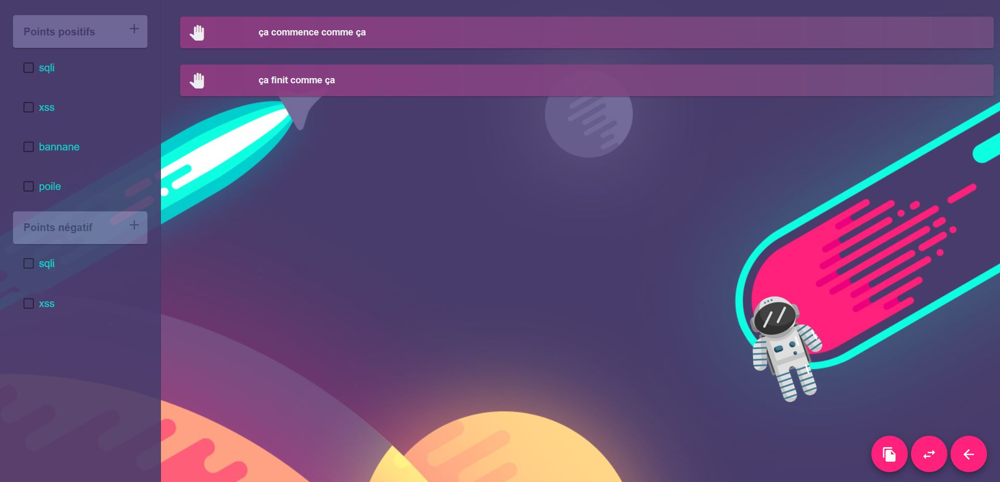
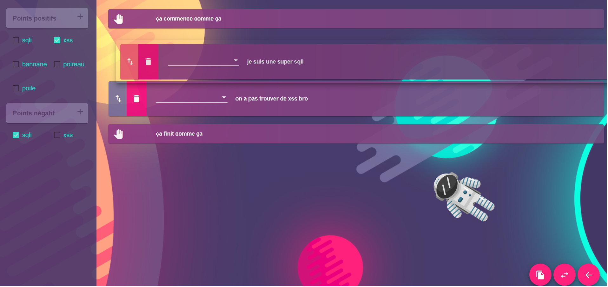

# TextGenerator

This project was generated with [Angular CLI](https://github.com/angular/angular-cli) version 7.3.5.

Purpuse  of this project is to preset paragraphes that you can choose later to made  up a report.
It work with preset json files that you have to choose when openning the app

Then you will be able to select preset options an add modification to them.
you can also reorganise them with drag n drop.

After what you 'll be able to copy it into clipboard to past it in your favorite text editor and finalize your page layout.

## Development server

Run `ng serve` for a dev server. Navigate to `http://localhost:4200/`. The app will automatically reload if you change any of the source files.

## Code scaffolding

Run `ng generate component component-name` to generate a new component. You can also use `ng generate directive|pipe|service|class|guard|interface|enum|module`.

## Build

Run `ng build` to build the project. The build artifacts will be stored in the `dist/` directory. Use the `--prod` flag for a production build.

## Running unit tests

Run `ng test` to execute the unit tests via [Karma](https://karma-runner.github.io).

## Running end-to-end tests

Run `ng e2e` to execute the end-to-end tests via [Protractor](http://www.protractortest.org/).

## Further help

To get more help on the Angular CLI use `ng help` or go check out the [Angular CLI README](https://github.com/angular/angular-cli/blob/master/README.md).
